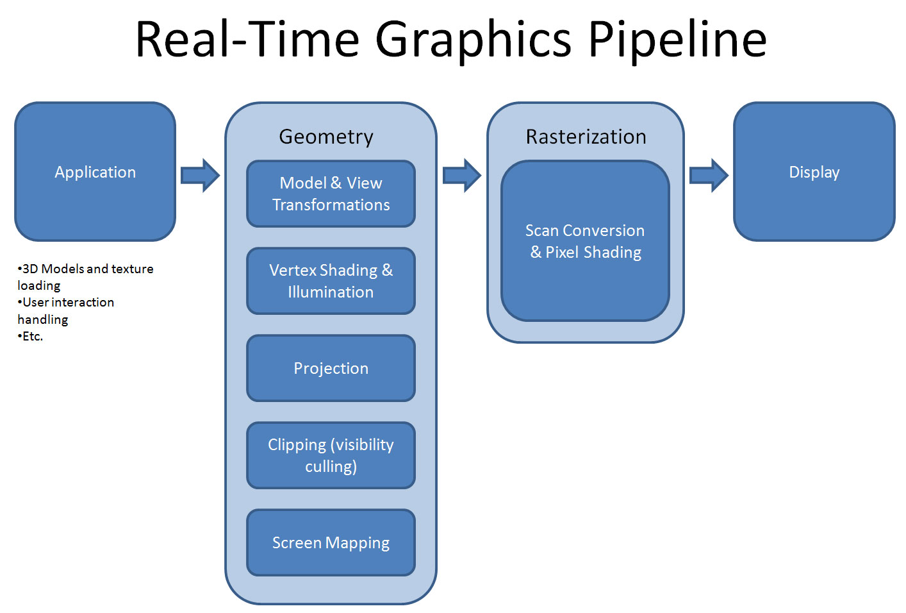
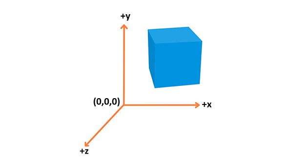
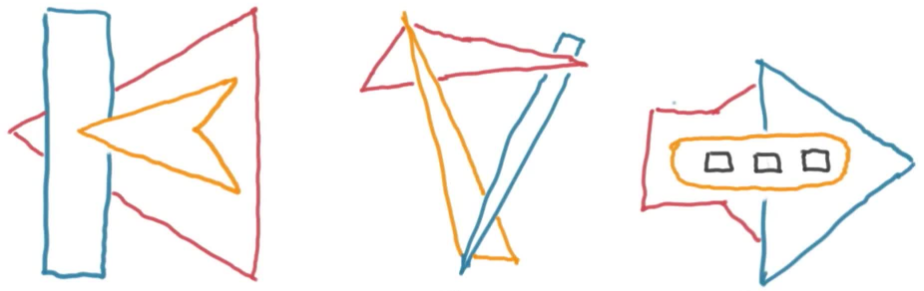

## three.js
Nicolas Bouvet

---

### Interactive 3D Rendering
* Rendering = créer une image
    * 60fps = 1/60s = 16.667ms
* 3d = monde en 3 dimensions
* Interactive = monde influençable
Note:
c'est ce que nous allons voir au travers de threejs  
pas uniquement lib mais aussi fondamentaux du dev 3d

rendering = créer une image

3d = définir des choses dans un environnement en 3 dimensions.  
plus particulièrement, dans la 3d "informatique", on définit des objets (meshes), matériaux, lumières et une caméra.  
On utilise ces informations pour rendre une image en 2 dimensions.  
Ecran -> fenêtre vers ce monde 3d. (d'autres exemples qu'un écran)

interactive = signifie que l'on peut influencer sur ce qu'il y a à l'écran (exemple basique : jeux vidéos)  

importance: identifier besoins/bottlenecks perfs, ...

---

### Hardware

---

### 3d Pipeline

Note:
scan conversion :
* Line drawing
* Polygon filling
* Depth test
* Texturing

---

### 3d pipeline

---

### Bases de la 3d
* coordonnées
* briques de base :
    * objects (meshes)
    * matériaux
    * lumières
    * caméra

---

### Système de coordonnées

(système main droite)
Note:
pouce: x
index: y (en l'air)
majeur : z
vecteur à 3 dimensions
utilisation des opérations classiques : multiplication, cross product, dot product

---

### Z-Buffer

---

three.js

---

### Mise en place de three.js

---
