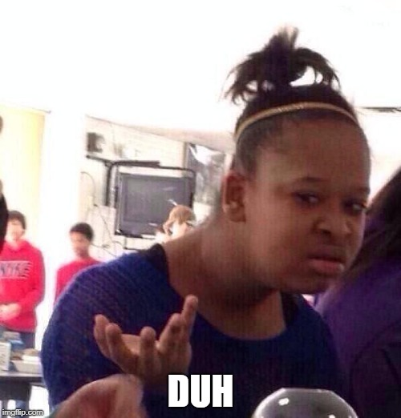
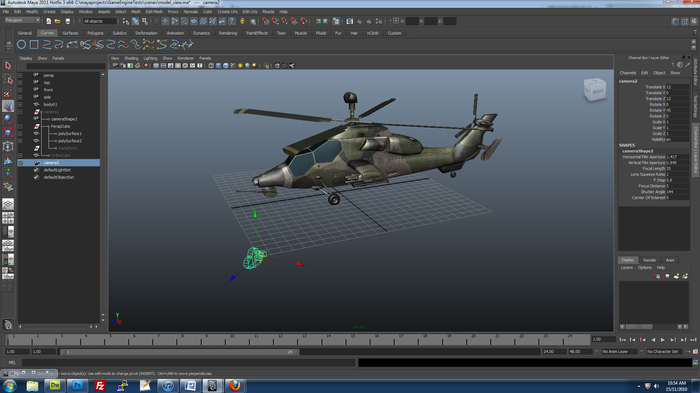
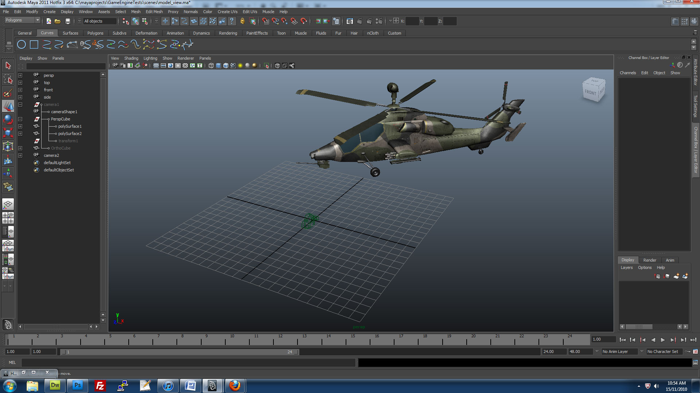
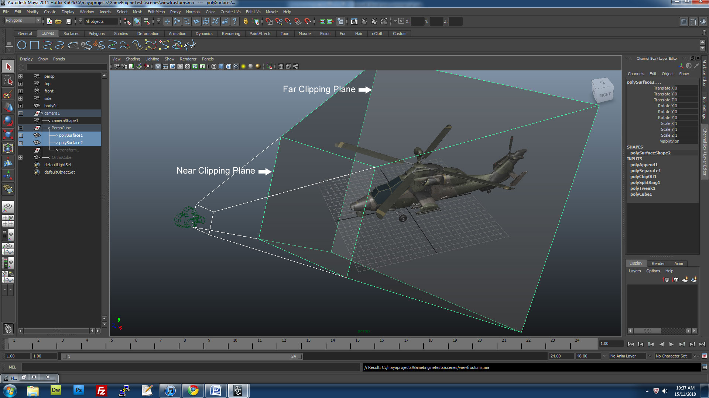
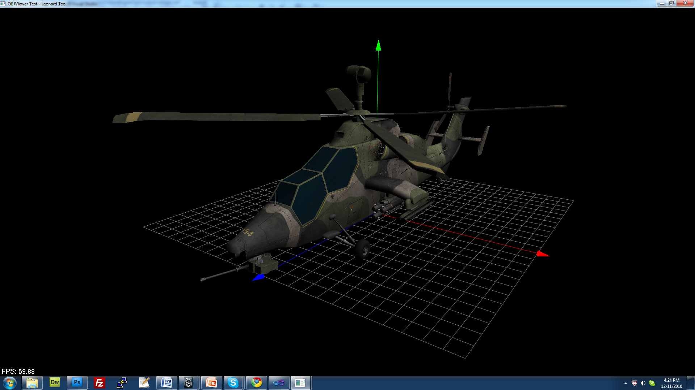
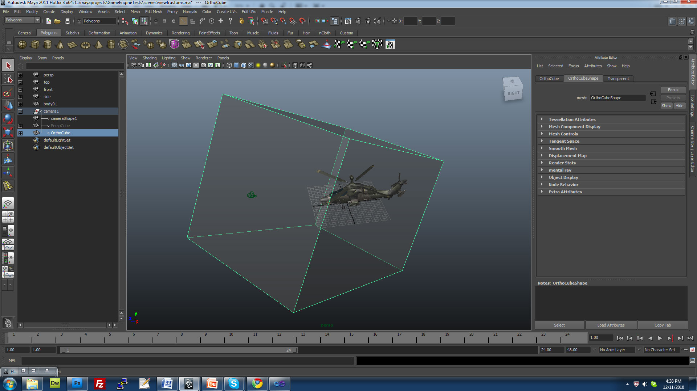
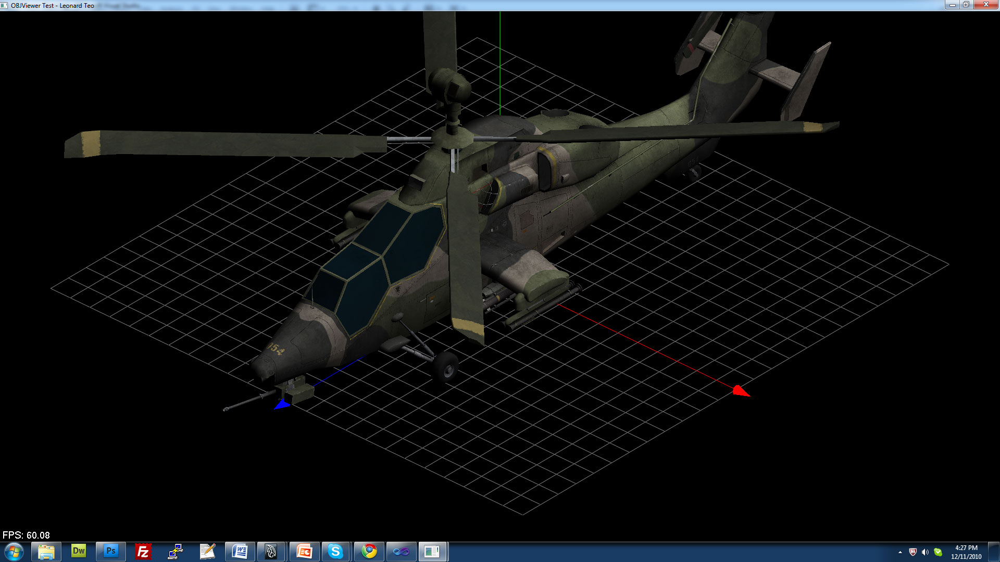
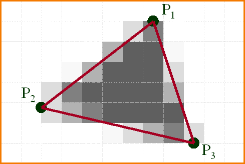
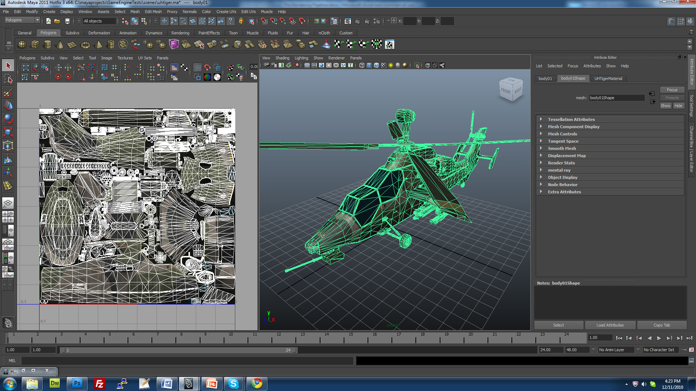
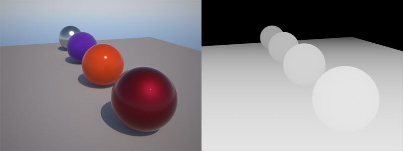

## three.js  
Nicolas Bouvet  
[bouvet.nicolas+esgi@gmail.com](mailto:bouvet.nicolas+esgi@gmail.com)
Note:
découvrir le pipeline pour créer des xp 3d (jeux, sites, ...)
au travers de three.js

---

### Interactive 3D Rendering
* Rendering = créer une image
    * 60fps = 1/60s = 16.667ms

* 3d = monde en 3 dimensions
* Interactive = monde influençable

Note:
c'est ce que nous allons voir au travers de threejs  
pas uniquement lib mais aussi fondamentaux du dev 3d

rendering = créer une image

3d = définir des choses dans un environnement en 3 dimensions.  
plus particulièrement, dans la 3d "informatique", on définit des objets (meshes), matériaux, lumières et une caméra.  
On utilise ces informations pour rendre une image en 2 dimensions.  
Ecran -> fenêtre vers ce monde 3d. (d'autres exemples qu'un écran)

interactive = signifie que l'on peut influencer sur ce qu'il y a à l'écran (exemple basique : jeux vidéos)  

implications: identifier besoins/bottlenecks, perfs, concessions...

---

### Hardware

* gestion mémoire vive et gpu
* où sont exécutées les fonctions
* identifier les devices ciblés
Note:
pourquoi c'est important de le rappeler  

connaître où sont exécutées les fonctions
où sont stockées les textures, framebuffers, images, meshes...
gestion mémoire gpu
GPU très hétérogènes, téléphones mobiles, ...
Penser aux devices dès le début du projet

---

### classic 3d Pipeline  
### aka  
### "forward rendering"

Note:
* pipeline utilisé en temps réel et en rendu  
* unity, unreal engine, godot
* autre mode : deferred rendering

Décrire succintement chaque étape

---

### Etape 1 : Application
* IHM
* Modification du monde 3d
* Gestion des ressources (objets 3d, images, ...)
* Output : liste de vertex/points, triangles, ...
Note:
* Côté CPU
* si on appuie sur une touche, le personnage avance, dans quelle direction, de combien d'unités
* IHM en web : clavier, souris, webcam, gyroscope, casque VR... (webUSB ?)
* Images -> Textures GPU
* /!\ Attention aux ressources, sur le Web (mémoire, bande passante, ...)

-=-

### Représentation d'un objet 3d

* Liste de vertex
* Type de polygone
* Optionnel : matériaux, textures, normales, UVs...
Note:
Pour bien comprendre la suite, explication de la représentation d'un objet 3d

---

### Etape 2 : Geometry
* Model & view transformations
* Vertex shading & illumination
* Projection
* Clipping
* Screen mapping

-=-

### Model & view transformations

* model transform: calcul de la position de l'objet selon sa translation/orientation/scale
Note:
les objets sont placés dans le monde, on calcule sa transformation sous forme de matrice

-=-

### Model & view transformations

* view transform: calcul de la position de l'objet selon la translation/orientation de la caméra
Note:
la caméra est en fait fixe. La view transform déplace tout le monde de telle sorte de ramener le monde autour de la caméra fixe.
Avec un peu de magie, on obtient ce qu'on appelle la model-view matrix, qui fournit une matrice de transformation pour l'objet, de telle sorte qu'on ait l'illusion qu'on regardee à travers cette caméra.

-=-

### Vertex shading
* manipulation des vertex à travers des shaders
* déformation, animation, skinning
* normales pour l'illumination
* très performant, relativement peu coûteux

-=-

### Projection

* forme de pyramide
* field of view, near/far clipping plane
* distorsion avec la distance  
(oeil humain : 135° vertical, 200° horizontal)

-=-

### Projection
  
résultat de projection en perspective

-=-

### Projection

* forme de cube
* pas de distorsion avec la distance

-=-

### Projection
  
résultat de projection en vue orthogonale

-=-

### Clipping
* Tout ce qui n'est pas dans le volume visible est ignoré
* Fait sur le GPU, mais d'autres méthodes existent sur le CPU

-=-

### ex: Frustum culling
<iframe width="560" height="315" src="https://www.youtube.com/embed/ORFuqih9V6Y" frameborder="0" allow="autoplay; encrypted-media" allowfullscreen></iframe>  
côté CPU

---

### Etape 3 : Rasterization
* 3d data > screen space coordinates
* Pour chaque pixel, déterminer ce qui est visible ou non
* Déterminer la couleur du pixel  
(lumières, z-buffer, fragment shader...)
* À cette étape :
    * Line drawing
    * Polygon filling
    * Texturing
    * Depth test

-=-

### Line drawing
* Affichage de lignes (duh, again)
* Opération essentielle : wireframes
* Quels pixels allumer entre deux points ?
* Algorithme populaire : Bresenham
Note:
https://en.wikipedia.org/wiki/Bresenham%27s_line_algorithm

-=-

### Polygon filling
  
* Déterminer quels pixels allumer à partir d'un polygone
* Algorithme populaire : scan-line method
* Beaucoup de brute force dans ces algos
Note:
Parmi les premiers à être accéléré par les GPUs

-=-

### Texturing
  
* Application de textures
* Coordonnées : UV
* Complexité à la préparation des objets 3D

-=-

### Depth test
* Déterminer quels objets sont devant lesquels
* N'afficher que ce qui est le plus près
* Comment garder l'information entre chaque polygone ?

-=-

### L'algorithme du peintre

* Dessiner plus du loin au plus près
* Au centre : troll case

-=-

### Z-Buffer

* Pour chaque pixel à dessiner, comparer avec  
la profondeur existante dans le Z-Buffer
* De 0 (plus proche) à 1 (plus éloigné)
* Linéaire (hardcodé) / Logarithmique (shader)

---

### Youpi, des pixels.
  

-=-

### Résumé du pipeline 3d

---

### Composants de base d'un monde 3d
* Coordonnées
* Objets (meshes)
* Matériaux
* Lumières
* Caméra

---

### Système de coordonnées

(système main droite)
Note:
pouce: x
index: y (en l'air)
majeur : z
vecteur à 3 dimensions
utilisation des opérations classiques : multiplication, cross product, dot product

---

### WebGL
* Créé par le Khronos group
* v1: 3 mars 2011
* v2 : 17 janvier 2017
* Navigateurs : Firefox 4+, Google Chrome 9+,  
Opera 12+, Safari 5.1+ and Internet Explorer 11+
* Accessible via Canvas
Note:
Khronos group = consortium dont le but est de créer des APIs multimédia publiques et gratuites  
En juin 2011, Microsoft exprime sa défiance vis-à-vis de la techno  
En juin 2013, Microsoft annonce le support dans IE11  
three.js, babylon.js, processing, blend4web  
Certains moteurs pro offrent un export en webgl : unity, unreal engine...
Egalement utilisé pour la 2d

---

### Librairies WebGL
* three.js
* Babylon.js
* Processing
* Unity, Unreal Engine

---

### three.js
* Créé par Ricardo Cabello (Mr.doob)
* Première release : 24 avril 2010
* Actuellement : r90 (14 février 2018)
* Rendus en WebGL, CSS3D, SVG

---

### Mise en place de three.js

<section>
<h3>Hello World !</h3>
<pre><code data-trim data-noescape style="max-height: 700px;">
    var camera, scene, renderer,
    geometry, material, mesh;

    init();
    animate();

    function init() {
        scene = new THREE.Scene();

        camera = new THREE.PerspectiveCamera( 75, window.innerWidth / window.innerHeight, 1, 10000 );
        camera.position.z = 1000;

        geometry = new THREE.BoxGeometry( 200, 200, 200 );
        material = new THREE.MeshBasicMaterial( { color: 0xff0000, wireframe: true } );

        mesh = new THREE.Mesh( geometry, material );
        scene.add( mesh );

        renderer = new THREE.CanvasRenderer();
        renderer.setSize( window.innerWidth, window.innerHeight );

        document.body.appendChild( renderer.domElement );
    }

    function animate() {
        // note: three.js includes requestAnimationFrame shim
        requestAnimationFrame( animate );
        render();
    }

    function render() {
        mesh.rotation.x += 0.01;
        mesh.rotation.y += 0.02;

        renderer.render( scene, camera );
    }
</code></pre>
</section>

Nouvelle diapo
