## three.js
### Transformations, graphe de scène
### Caméras, matériaux & couleurs

Nicolas Bouvet

---

### 3d pipeline

Note:
rappel

---

### Transformations

* translation
* rotation
* scale
Note:
transformations -> matrice de transformation
matrices multipliées suivant le graphe de scène

<section>
<h3>Transformations</h3>
<pre><code data-trim data-noescape style="max-height: 700px;">
var mesh = new THREE.Mesh(new THREE.BoxGeometry(1, 1, 1), new THREE.MeshBasicMaterial());

console.log(mesh.position);
console.log(mesh.rotation);
console.log(mesh.scale);
</code></pre>
</section>

### Graphe de scène
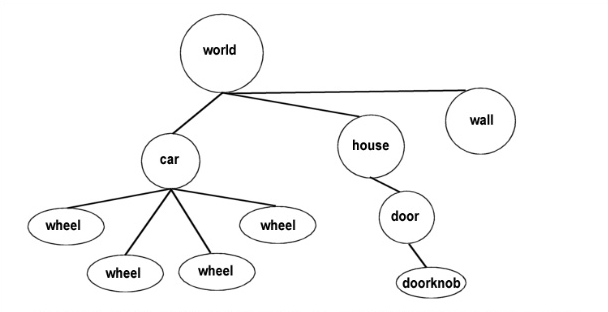
* représenté sous forme d'arbre
* un noeud peut avoir plusieurs enfants
* un noeud n'a qu'un seul parent
Note:
expliquer la hiérarchie des objets dans un monde 3d
(arbre)
Un graphe de scène est une structure générale de données utilisée communément par les outils de modélisation 3D et les jeux vidéo actuels.
Le graphe de scène structure de manière logique la représentation spatiale d'une scène graphique.
La définition d'un graphe de scène est floue, puisque les programmeurs qui implémentent les graphes de scènes dans les applications, plus particulièrement dans l'industrie du jeu vidéo, reprennent les principes généraux et les adaptent à leurs besoins particuliers.

D'une manière générale, un graphe de scène est une collection de nœuds renfermée dans un graphe ou une structure d'arbre.
Ceci signifie qu'un nœud peut avoir plusieurs enfants mais seulement un parent. Ainsi, un effet appliqué sur un nœud se répercute sur ses descendants, ce qui permet de propager l'opération à un groupe de nœuds. Dans de nombreux programmes, l'utilisation typique est pour appliquer une transformation géométrique à un groupe d'objets.

<section>
<h3>Graphe de scène</h3>
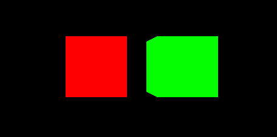
<pre><code data-trim data-noescape style="max-height: 700px;">
var scene = new THREE.Scene();

var parent = new THREE.Mesh(new THREE.BoxGeometry(200, 200, 200), new THREE.MeshBasicMaterial({ color: 0xff0000 }));

var child = new THREE.Mesh(new THREE.BoxGeometry(200, 200, 200), new THREE.MeshBasicMaterial({ color: 0x00ff00 }));
child.position.x = 300;

scene.add(parent);
parent.add(child);

// empty container
new THREE.Object3D();
</code></pre>
</section>

### Exercice
* Une hiérarchie de cubes
* Les animer indépendamment (clavier/souris/auto)

---

### Caméras

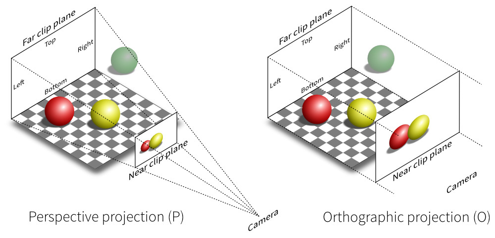  

* Perspective
* Orthographique

---

#### Perspective camera

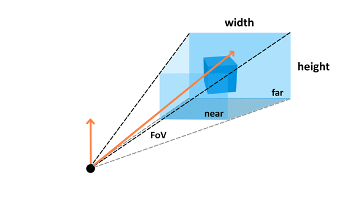  
THREE.PerspectiveCamera(fov, aspect, near, far)
* fov — Camera frustum vertical field of view.
* aspect — Camera frustum aspect ratio.
* near — Camera frustum near plane.
* far — Camera frustum far plane.

<section>
<h3>Perspective camera</h3>
<pre><code data-trim data-noescape style="max-height: 700px;">
var camera = new THREE.PerspectiveCamera(75, window.innerWidth / window.innerHeight, 1, 1000);
</code></pre>
</section>

#### Orthographic camera

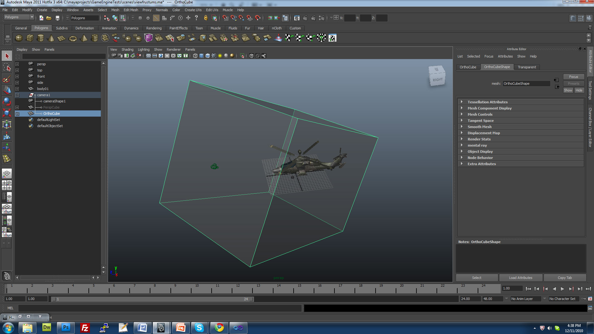  
THREE.OrthographicCamera(left, right, top, bottom, near, far)
* left — Camera frustum left plane.
* right — Camera frustum right plane.
* top — Camera frustum top plane.
* bottom — Camera frustum bottom plane.
* near — Camera frustum near plane.
* far — Camera frustum far plane.

<section>
<h3>Window resize</h3>
<pre><code data-trim data-noescape style="max-height: 700px;">
// window resize
window.addEventListener('resize', () => {
    camera.aspect = window.innerWidth / window.innerHeight;
    camera.updateProjectionMatrix();
    renderer.setSize(window.innerWidth, window.innerHeight);
}, false);
</code></pre>
</section>

### Exercice : déplacement FPS
* contrôle clavier/souris
* (flêche haut = déplacement dans la direction visée)

---

### Matériaux et couleurs

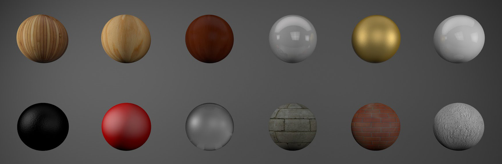  
* Propriétés visuelles de l'objet (mais pas que)
* Entièrement customs : shaders

Note:
Principalement utilisé pour définir les propriétés visuelles (réaction à la lumière)

---

### Couleurs

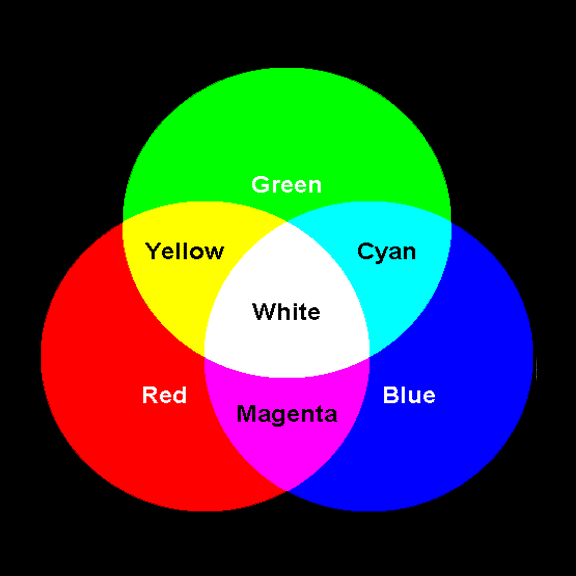  
3 composantes : rouge, vert, bleu
Mode : couleurs additives

* float : 0 à 1
* integer : 0 * 255
* hexa : 0xaabbcc

---

### Principaux matériaux
* MeshBasicMaterial
* MeshLambertMaterial
* MeshPhongMaterial
* MeshNormalMaterial
* ...  
[https://threejs.org/docs](https://threejs.org/docs)

---

### Textures

Différents types :
* Color map
* Bump map
* Specular map
* Environment map

Requis : coordonnées UVs

### Color map

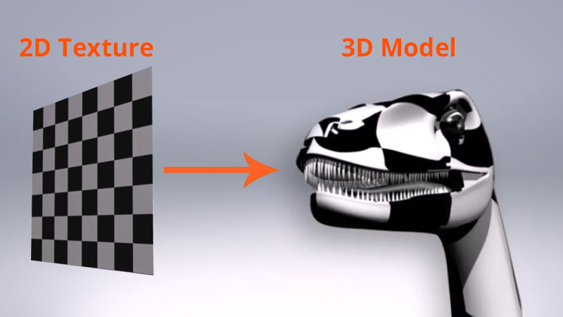

<section>
<h3>Charger et appliquer une texture</h3>
<pre><code data-trim data-noescape style="max-height: 700px;">
var texture = new THREE.TextureLoader().load('images/cube.png');
var material = new THREE.MeshBasicMaterial({
    map: texture
});
</code></pre>
</section>

### Bump map
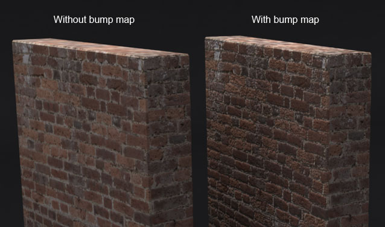  
* Texture noir & blanc
* Utilisé pour ajouter de la granularité

---

### Normal map

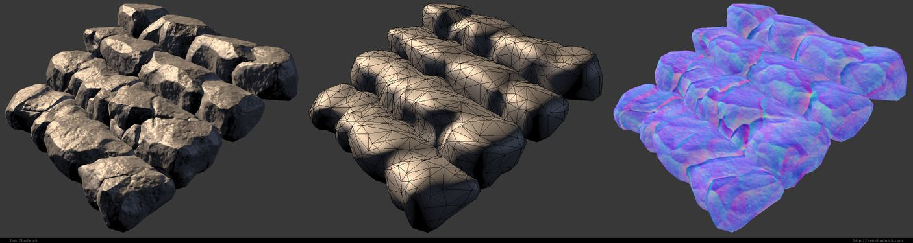  
* Evolution du bump map
* Texture RGB -> normales XYZ
* Economie de faces

---

### Ex: Color map

  

---

### Ex: Bump map

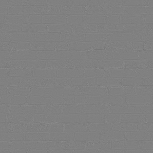  

---

### Ex: Normal map

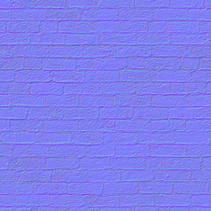  

---

### Color + Bump + Normal maps

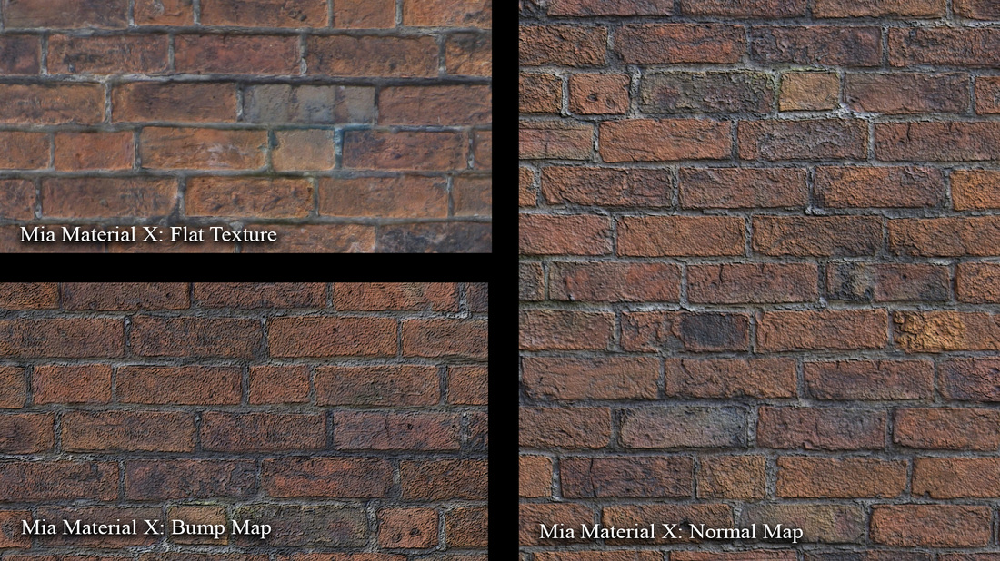  

---

### Exercice : créer un système solaire
* Soleil
* Terre + Lune, Mars, ...
* Quelques planètes avec différents matériaux

---

### Exercice : créer un personnage animé
[https://moments.epic.net/](https://moments.epic.net/)

---

### Projet : Minecraft
* naviguer dans un monde de cubes
* créer/modifier/supprimer des cubes
* au moins **1 shader**
* au moins un effet graphique  
(particules, postprocessing, ...)
