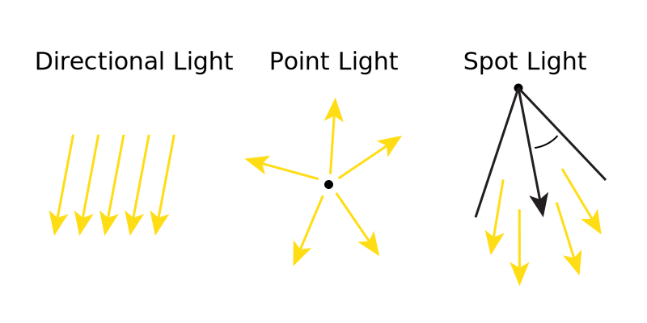
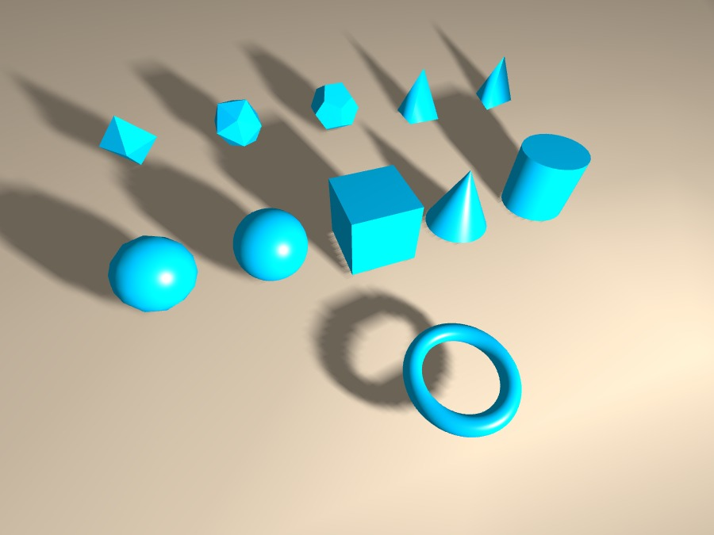

## three.js
### Lumières, meshes

Nicolas Bouvet

---

### Lumières
  
* Ambient light : lumière diffuse
* Directional light : soleil
* Point light : ampoule, feu, ...
* Spot light : projecteur, réverbère

---

### Lumières
  

---

### Lumières

Modèle d'éclaire simple :
* EMISSIVE : couleur de base de l'objet
* AMBIENT : lumière ambiante
* DIFFUSE : couleur de la lumière
* SPECULAR : brillance
Note:
EMISSIVE : pour colorer les objets brillants (ex: ampoule)  
Non affecté par les lumières  
AMBIENT : simuler l'éclairage ambiant, spécialement dans les zones non éclairées directement
DIFFUSE : calculé par les lumières de la scène. Eclairage mat.
SPECULAR : éclairage révélant la brillance des objets. Dépendant de la caméra.

---

### Lumières

* EMISSIVE
* \+ AMBIENT
* \+ pour chaque lumière :
  * DIFFUSE(lumière) + SPECULAR(lumière, caméra)
Note:
EMISSIVE : définie pour chaque objet
AMBIENT : définie pour la scène

---

### Diffuse + Specular

dot product (produit scalaire) : a · b = |a| × |b| × cos(θ)
Note:
NORMALISER LES VECTEURS AVANT CALCUL !!!  
l : direction de la lumière  
n : normale  
phi : angle entre l et n ( l dot n)  
v : view direction  
r : reflection de l par rapport à n  
alpha : angle entre r et v > utilisé pour calculer l'intensité du composant spéculaire

<section>
<h3>Lumières</h3>
<pre><code data-trim data-noescape style="max-height: 700px;">
new THREE.AmbientLight(0x404040);

new THREE.DirectionalLight(0xffffff, 0.5);
// light.position;
// light.target;

new THREE.PointLight(0xff0000, 1, 100);
// light.position;
</code></pre>
</section>

### Quelques matériaux répondant à la lumière
* MeshLambertMaterial
* MeshPhongMaterial
* MeshStandardMaterial  

---

### Meshes
* Liste de vertex
* Liste de faces
* type (ex: triangles, lignes, ...)

---

### Meshes
Fournis par three.js
* BoxGeometry
* SphereGeometry
* PlaneGeometry
* CylinderGeometry
* ...
Note:
Geometry + BufferGeometry

---

### Différents types

<section>
<h3>Geometry</h3>
<pre><code data-trim data-noescape style="max-height: 700px;">
var geometry = new THREE.Geometry();

geometry.vertices.push(
	new THREE.Vector3( -10,  10, 0 ),
	new THREE.Vector3( -10, -10, 0 ),
	new THREE.Vector3(  10, -10, 0 ),
	...
);
geometry.faces.push( new THREE.Face3( 0, 1, 2 ), ... );

var material = new THREE.MeshBasicMaterial( { color: 0xffff00 } );

var mesh = new THREE.Mesh( geometry, material );
mesh.drawMode = THREE.TrianglesDrawMode; //default
</code></pre>
</section>

<section>
<h3>BufferGeometry</h3>
<pre><code data-trim data-noescape style="max-height: 700px;">
var geometry = new THREE.BufferGeometry();
// create a simple square shape. We duplicate the top left and bottom right
// vertices because each vertex needs to appear once per triangle.
var vertices = new Float32Array( [
	-1.0, -1.0,  1.0,
	 1.0, -1.0,  1.0,
	 1.0,  1.0,  1.0,

	 1.0,  1.0,  1.0,
	-1.0,  1.0,  1.0,
	-1.0, -1.0,  1.0
] );

// itemSize = 3 because there are 3 values (components) per vertex
geometry.addAttribute( 'position', new THREE.BufferAttribute( vertices, 3 ) );
var material = new THREE.MeshBasicMaterial( { color: 0xff0000 } );
var mesh = new THREE.Mesh( geometry, material );
</code></pre>
</section>

### Autres meshes
* Line
* LineSegments
* Points

<section>
<h3>Ex: Line</h3>
<pre><code data-trim data-noescape style="max-height: 700px;">
var material = new THREE.LineBasicMaterial({
	color: 0x0000ff
});

var geometry = new THREE.Geometry();
geometry.vertices.push(
	new THREE.Vector3( -10, 0, 0 ),
	new THREE.Vector3( 0, 10, 0 ),
	new THREE.Vector3( 10, 0, 0 )
);

var line = new THREE.Line( geometry, material );
scene.add( line );
</code></pre>
</section>

### Exercice : créer un personnage animé
[https://moments.epic.net/](https://moments.epic.net/)

---

### Projet : Minecraft
* naviguer dans un monde de cubes
* créer/modifier/supprimer des cubes
* au moins **1 shader**
* au moins un effet graphique  
(particules, postprocessing, ...)
