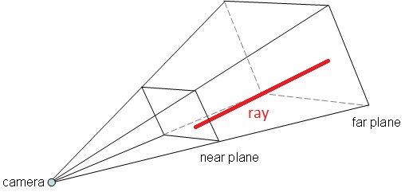

## three.js
### Picking, animations, particules

Nicolas Bouvet

---

### Picking

* transformer position 2D en rayon 3D
* test de collision entre le rayon et les objets
* THREE.Raycaster

<section>
<h3>Picking</h3>
<pre><code data-trim data-noescape style="max-height: 700px;">
var raycaster = new THREE.Raycaster();
var mouse = new THREE.Vector2();

function onMouseMove( event ) {
	// calculate mouse position in normalized device coordinates
	// (-1 to +1) for both components

	mouse.x = ( event.clientX / window.innerWidth ) * 2 - 1;
	mouse.y = - ( event.clientY / window.innerHeight ) * 2 + 1;
}

function render() {
	// update the picking ray with the camera and mouse position
	raycaster.setFromCamera( mouse, camera );

	// calculate objects intersecting the picking ray
	var intersects = raycaster.intersectObjects( scene.children );

	for ( var i = 0; i < intersects.length; i++ ) {
		intersects[ i ].object.material.color.set( 0xff0000 );
	}

	renderer.render( scene, camera );
}

window.addEventListener( 'mousemove', onMouseMove, false );
window.requestAnimationFrame(render);
</code></pre>
</section>

### Exercice
* Afficher des cubes à des positions aléatoires
* Changer leur couleur uniquement quand la souris les touche

---

### Animations avec GreenSock
### [https://greensock.com/](https://greensock.com/)

* Facile, fiable
* Permet de tout animer (css, n'importe quel objet javascript...)

<section>
<h3>GreenSock : utilisation</h3>
<pre><code data-trim data-noescape style="max-height: 700px;">
TweenLite.to(
    element,
    duration,
    {fromVars + options}
);

TweenLite.fromTo(
    element,
    duration,
    {fromVars}
    {toVars + options}
);

// également : TweenLite.from
</code></pre>
</section>

<section>
<h3>GreenSock : exemple</h3>
<pre><code data-trim data-noescape style="max-height: 700px;">
var data = {
    x: 0
};

var myTween = TweenLine.to(
    data,
    2,
    {
        x: 100,
        ease: Circ.easeInOut,
        delay: 1,
        onComplete: function() {
            console.log("myTween complete !");
        }
    }
);

myTween.kill();
</code></pre>
</section>

### Exercice
* Créer un mur de cubes
* Les animer au survol de la souris

---

### Particules

* Technique utilisée pour simuler des phénomènes pseudo-aléatoires, compliqués à animer conventionnellement.
* Utilise des sprites, objets 3D, ...
* Feu, fumée, eau, explosions, poussières, étoiles, effets magiques, ...

---

### Particules

* Emetteur
* Particule
    * Fréquence d'émission
    * Durée de vie
    * Propriétés visuelles : direction, couleur, taille, ...

---

### Exercice

* Faire tomber de la neige

---

### Exercice

* Faire du feu
