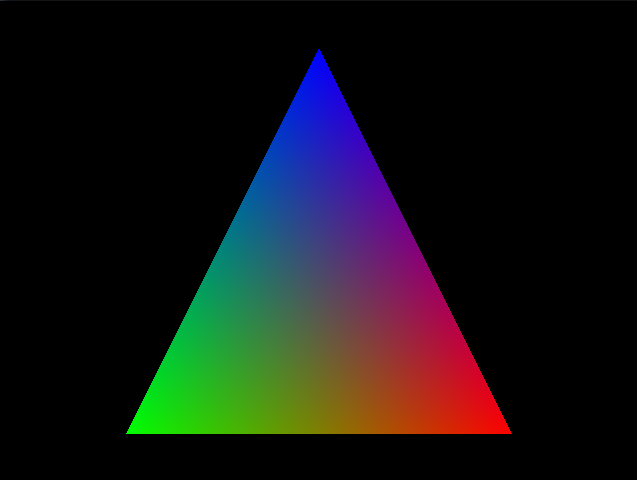
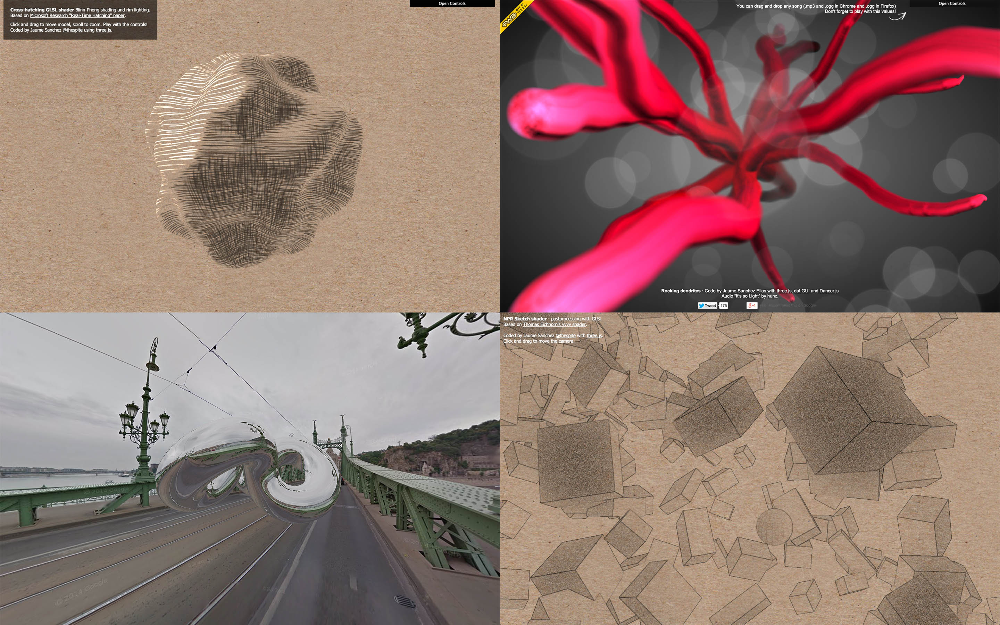
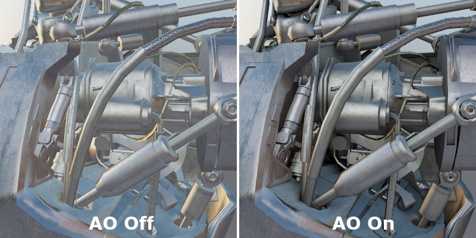

## three.js
### Shaders, postprocessing

Nicolas Bouvet

---

### 3d pipeline

Note:
rappel

---

### GLSL (OpenGL)

* OpenGL Shading Language
* Shader = programme
    * source > compilation > execution
* Vertex shader, fragment shader, geometry shader...
* DirectX : HLSL

---

### Intérêt des shaders

* Flexibilité : contrôle quasi absolu du rendu de chaque pixel
* Côte GPU : décharge le CPU d'opérations lourdes

---

#### GLSL

* Language proche du C
* Typé
    * int : entier
    * float : flottant
    * bool : booléen, peut valoir true ou false
    * vec2, vec3, vec4 : vecteur à 2/3/4 composantes flottantes
    * mat2, mat3, mat4 : matrice 2*2, 3*3, 4*4 de flottants
    * ivec2, ivec3, ivec4 : vecteur à 2/3/4 composantes entières
    * bvec2, bvec3, bvec4 : vecteur à 2/3/4 composantes booléennes
    * sampler2D : texture 2D
* Les variables préfixées gl_ sont réservées au langage lui-même,  
il est donc interdit de créer une variable dont le nom commence par gl_ !

<section>
<h3>GLSL</h3>
<pre><code data-trim data-noescape style="max-height: 700px;">
float var1 = 0.2, var2 = 3.0;
float resultat = (var1 - 0.1) * var2;

// opérateurs surchargés
mat4 a = ..., b = ...;
mat4 resultat = a * b;

// vecteurs et matrices
vec4 position = vec4(0.0);
mat4 m = mat4(1.0);
vec4 resultat = m * position;

// cast
float flottant = (float)entier;

vec3 v = vec3(1.0, 2.0, 3.0);
vec2 v2 = vec2(v);
// OU
vec2 v2 = vec2(v.x, v.y);
// OU
vec2 v2 = v.xy;

vec2 = vec2(1.0, 2.0);
vec3 v3 = vec3(v2, 3.0);

// matrice
vec4 a, b, c, d;
 
a = vec4(1.0, 0.0, 0.0, 0.0);
b = vec4(0.0, 1.0, 0.0, 0.0);
c = vec4(0.0, 0.0, 1.0, 0.0);
d = vec4(0.0, 0.0, 0.0, 1.0);
 
mat4 m = mat4(a, b, c, d);
mat4 m = mat4(1.0);

// tableaux
float tab[3] = {0.0, 0.5, 1.0};

int case = 2;
float val = tab[case]; // val = 1

mat4 m = mat4(
    1.0, 0.0, 0.0, 0.0,
    0.0, 1.0, 0.0, 0.0,
    0.0, 5.0, 1.0, 0.0,
    0.0, 0.0, 0.0, 1.0);
float var = m[2][1]; // ici, var = 5.0

// function
int myFunction(float a) {
    return 0;
}

void myFunction2() {
}
</code></pre>
</section>

### Vertex Shader

* Exécuté sur chaque vertex
* En entrée : (fournis par three.js)
    * projectionMatrix (mat4)
    * modelViewMatrix (mat4)
    * position (vec3)
    * normal (vec3)
    * uv (vec2)
* En sortie : gl_Position (vec4)

<section>
<h3>Vertex Shader</h3>
<pre><code data-trim data-noescape style="max-height: 700px;">
void main() {
    gl_Position = projectionMatrix * modelViewMatrix * vec4(position, 1.0);
}
</code></pre>
</section>

### Fragment Shader

* Exécuté sur chaque pixel à dessiner
* En sortie : gl_FragColor (vec4)
* Pour ne pas afficher le pixel : discard;

<section>
<h3>Fragment Shader</h3>
<pre><code data-trim data-noescape style="max-height: 700px;">
void main() {
    gl_FragColor = vec4(1.0, 0.0, 1.0, 1.0);
}
</code></pre>
</section>

<section>
<h3>ShaderMaterial</h3>
<pre><code data-trim data-noescape style="max-height: 700px;">
new THREE.ShaderMaterial({
    vertexShader: myVertexShaderText,
    fragmentShader: myFragmentShaderText
});

// également : RawShaderMaterial
</code></pre>
</section>

### Exercice

* Créer une sphère jaune

---

### Vertex Shader > Fragment Shader : varying

* Déclaration globale dans les vertex & fragment shaders
* varying type nom_variable;
* ex: varying vec3 position;

<section>
<h3>Varying : Vertex Shader</h3>
<pre><code data-trim data-noescape style="max-height: 700px;">
varying vec3 vNormal;

void main() {
    vNormal = normal;

    gl_Position = projectionMatrix * modelViewMatrix * vec4(position, 1.0);
}
</code></pre>
</section>

<section>
<h3>Varying : Fragment Shader</h3>
<pre><code data-trim data-noescape style="max-height: 700px;">
varying vec3 vNormal;

void main() {
    vec3 light = vec3(0.5, 0.2, 1.0);
    light = normalize(light);

    float dProd = max(0.0, dot(vNormal, light));

    gl_FragColor = vec4(dProd, dProd, dProd, 1.0);
}
</code></pre>
</section>

### Equation simple d'éclairage

* produit scalaire de : normale & vecteur lumière
    * a · b = |a| × |b| × cos(θ)
    * coefficient de luminosité (entre -1 et 1)
* attention : normaliser les vecteurs
* GLSL :
    * produit scalaire : dot(veci, veci)
    * normaliser : normalize(veci)

---

### Exercice

* Eclairer la sphère avec une lumière directionnelle

---

### Communication Javascript > Shaders : Uniforms

* Déclaré dans le material
* Utilisable dans le vertex & fragment shader
* uniform type nom_variable;
* ex: uniform vec3 myUniform;

<section>
<h3>Uniforms</h3>
<pre><code data-trim data-noescape style="max-height: 700px;">
var myUniforms = {
    time: {
        value: 0
    },
    light: {
        value: new THREE.Vector3(0.0, 1.0, 2.0)
    }
};

new THREE.ShaderMaterial({
    uniforms: myUniforms,
    vertexShader: myVertexShaderText,
    fragmentShader: myFragmentShaderText
});
</code></pre>
</section>

<section>
<h3>Uniforms : Vertex Shader</h3>
<pre><code data-trim data-noescape style="max-height: 700px;">
uniform float time;
uniform vec3 light;

void main() {
    gl_Position = projectionMatrix * modelViewMatrix * vec4(position, 1.0);
}
</code></pre>
</section>

### Exercice

* Eclaire la sphère avec une point light
* Faire tourner la lumière autour de la sphère

---

### Attributs de chaque vertex : Attributes

* Données stockées pour chaque vertex
* Position, normale, uv... sont des attributs
* On peut ajouter : float, vec2, vec3, ...

<section>
<h3>Attributes</h3>
<pre><code data-trim data-noescape style="max-height: 700px;">
geometry = new THREE.SphereBufferGeometry(8, 32, 32);

var myAttribute = new Float32Array(geometry.attributes.position.count);

geometry.addAttribute('myAttribute', new THREE.BufferAttribute(myAttribute, 1));

for(var i=0; i&#60;myAttribute.length; i++) {
    myAttribute[i] = Math.random();
}

geometry.attributes.myAttribute.needsUpdate = true;
</code></pre>
</section>

<section>
<h3>Attributes : Vertex Shader</h3>
<pre><code data-trim data-noescape style="max-height: 700px;">
attribute float myAttribute;

void main() {
    gl_Position = projectionMatrix * modelViewMatrix * vec4(position, 1.0);
}
</code></pre>
</section>

### Exercice

* Animer la déformation de la sphère

---

### Postprocessing

* Effets appliqués après le rendu de la scène
* Flou, bloom, ambient occlusion, tone mapping, ...
* Principe :
    * Rendre la scène dans une texture (via FrameBuffer)
    * Ping-pong entre 2 FrameBuffers en appliquant des shaders
    * Rendre la texture à l'écran en plein écran (via 2 triangles)

---

### Postprocessing

---

### Postprocessing

<section>
<h3>Postprocessing</h3>
<pre><code data-trim data-noescape style="max-height: 700px;">
var composer = new THREE.EffectComposer(renderer);

var renderPass = new THREE.RenderPass(scene, camera);
composer.addPass(renderPass);

var copyPass = new THREE.ShaderPass(THREE.CopyShader);
copy.renderToScreen = true;
composer.addPass(copyPass);

// dans la fonction render
composer.render();
// renderer.render(scene, camera);

// pro tip :
composer.passes[composer.passes.length - 1].renderToScreen = true;
</code></pre>
</section>

### Imports

* import 'three/examples/js/shaders/CopyShader';
* import 'three/examples/js/postprocessing/EffectComposer';
* import 'three/examples/js/postprocessing/RenderPass';
* import 'three/examples/js/postprocessing/ShaderPass';

---

### Exercice

* Tester les shaders & passes fournis par three.js
* three/examples/js/shaders
* three/examples/js/postprocessing

<section>
<h3>Custom shader</h3>
<pre><code data-trim data-noescape style="max-height: 700px;">
var blackWhiteShader = {
    uniforms: {
        "tDiffuse": { value: null },
        "power": { value: 1 }
    },
    vertexShader: [
        "varying vec2 vUv;",
        "void main() {",
            "vUv = uv;",
            "gl_Position = projectionMatrix * modelViewMatrix * vec4( position, 1.0 );",
        "}"
    ].join( "\n" ),
    fragmentShader: [
        "uniform sampler2D tDiffuse;",
        "varying vec2 vUv;",
        "void main() {",
            "vec4 color = texture2D(tDiffuse, vUv);",
            "float gray = (color.r + color.g + color.b) / 3.0;",
            "gl_FragColor = vec4(mix(color.rgb, vec3(gray), power), 1.0);",
        "}"
    ].join( "\n" )
};

var blackWhitePass = new THREE.ShaderPass(blackWhiteShader);
blackWhitePass.uniforms.power.value = 0.5;
composer.add(blackWhitePass);
</code></pre>
</section>

### Exercice

* Créer un shader qui inverse les couleurs

---

### Exercice

* Créer un shader qui pixelise l'image

---

### Exercice

* Créer un shader de flou
